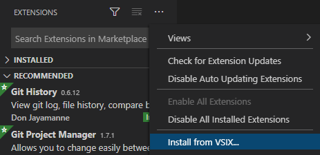

# Swift for Visual Studio Code

## Installation

Currently, the only way to install this extension is to build it from source. To do this, you'll need to have [Node.js](https://nodejs.org) installed. On Linux, make sure to install Node.js from its official website or from [NodeSource](https://github.com/nodesource/distributions/) as the version included with your distribution may be outdated.

Next, clone this repository, and run the following commands:

```
npm install
npm run package
```

This will generate a file with the **vsix** extension. To install this file, select **View ▸ Extensions** from the menu bar, click the triple dots, then select **Install from VSIX...**:



Alternatively, if you just want to try this extension without installing it, open this project in Visual Studio Code and press **F5** to launch an instance of Visual Studio Code with the extension enabled.

## Features

### Automatic task creation

For workspaces that contain a **Package.swift** file, this extension will create the following tasks:

- **Build All Targets** (`swift build`)
- **Clean Build Artifacts** (`swift package clean`)
- **Resolve Package Dependencies** (`swift package resolve`)
- **Update Package Dependencies** (`swift package update`)
- **Run** (`swift run`), for every executable target in the package.

These tasks are available via **Terminal ▸ Run Task...** and **Terminal ▸ Run Build Task...**.

You can customize a task by clicking the gear icon next to it. This will add the task to **tasks.json**, where you can customize its properties. For example, here’s how you add `--env production` command line arguments to the **Run** target from a Vapor project:

```json
{
    "version": "2.0.0",
    "tasks": [
        {
            "type": "swift",
            "command": "swift",
            "args": [
                "run",
                "Run",
                "--env",
                "production"
            ],
            "group": "build",
            "label": "swift: Run in Production Environment"
        }
    ]
}
```

Custom tasks support the following properties:

- **type** (required): must be set to `"swift"`.
- **command** (required): the base command to execute. Don’t include any arguments as the command will be quoted if it contains spaces.
- **args** (required): list of arguments for the base command. Each argument will be individually quoted if it contains spaces.
- **group** (optional): either `"build"` or `"test"`.
- **label** (optional): a name for the task. You should overwrite this property to differentiate your customized task from the ones provided by this extension.
- **detail** (optional): a description of this task. If not provided, the task’s command (including its arguments) will be used instead.

### Package dependencies

If your workspace contains a package that has dependencies, this extension will add a **Package Dependencies** view to the Explorer:


Additionally, the extension will monitor **Package.swift** and **Package.resolved** for changes, resolve any changes to the dependencies, and update the view as needed.

> **Note**: When browsing the files in a package, Visual Studio Code may also open these files in the Explorer. If this is undesirable, open **Preferences ▸ Settings** and set **Explorer: Auto Reveal** to `false`.

## Configuration

You can find the settings for this extension in **Preferences ▸ Settings** under **Extensions ▸ Swift** or by searching for the prefix `swift`.

The following settings are available:

- **excludePathsFromPackageDependencies**: A list of paths to exclude from the Package Dependencies view.
